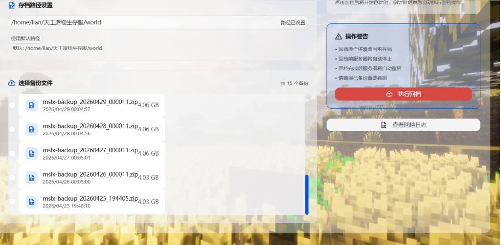

# MSLX 服务器回档插件

为 MSLX 开服器提供一键回档功能的插件。

## 功能特性

- 📋 **服务器信息展示** - 实时显示服务器名称、路径、运行状态等信息
- 📁 **备份文件管理** - 自动扫描并展示备份目录中的所有备份压缩包
- ⚙️ **存档路径配置** - 支持自定义存档路径设置
- 📢 **回档公告** - 支持发送回档公告通知玩家
- ⏱️ **倒计时确认** - 回档前的确认倒计时机制
- 🔄 **一键回档** - 快速恢复服务器存档到指定备份版本

## 界面预览

### 主界面


### 备份文件列表



## 技术栈

- **后端**: .NET 10 + C#
- **前端**: Vue 3 + TypeScript + TDesign Vue Next
- **插件框架**: MSLX SDK

## 安装说明

1. 编译项目：
```bash
dotnet build --configuration Release
```

2. 将生成的 `MSLX.Plugin.Demo.dll` 复制到 MSLX 插件目录

3. 重启 MSLX 服务

## 使用方法

1. 在 MSLX 管理中心左侧菜单中点击「服务器回档」
2. 查看服务器状态和备份列表
3. 选择要恢复的备份文件
4. 设置回档公告（可选）和倒计时
5. 点击「执行回档」完成操作

## 项目结构

```
├── Controllers/           # 后端 API 控制器
│   └── RollbackController.cs
├── Frontend/              # 前端代码
│   ├── src/
│   │   ├── views/
│   │   │   └── RollbackPage.vue
│   │   └── pluginEntry.ts
│   └── package.json
├── assets/                # 资源文件
│   └── *.png
├── MSLXPluginEntry.cs     # 插件入口
└── README.md
```

## 许可证

MIT License
